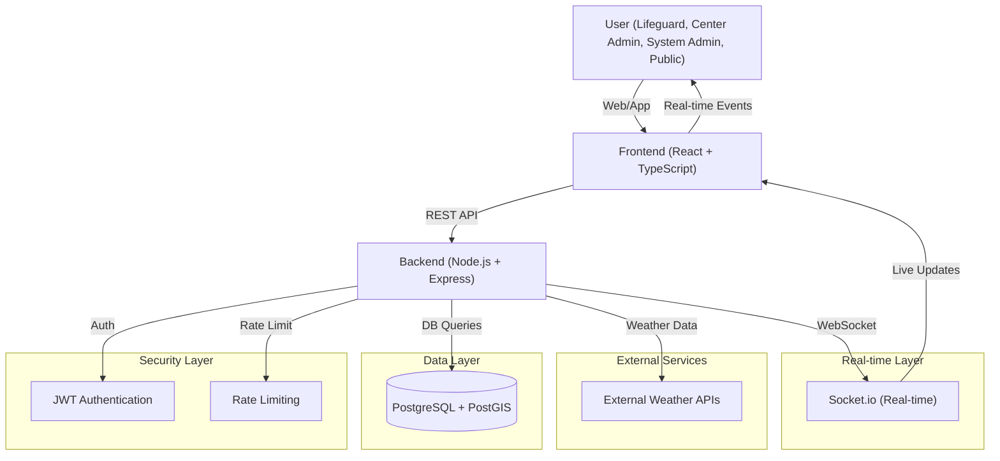
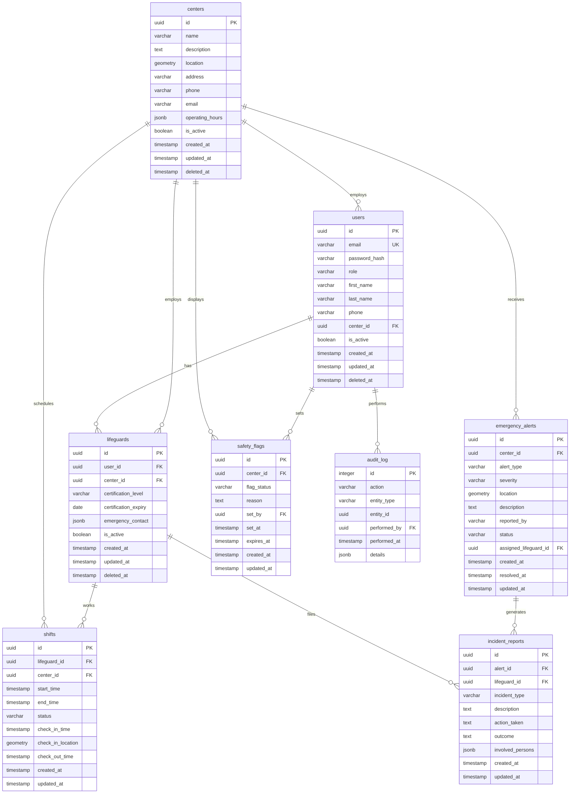
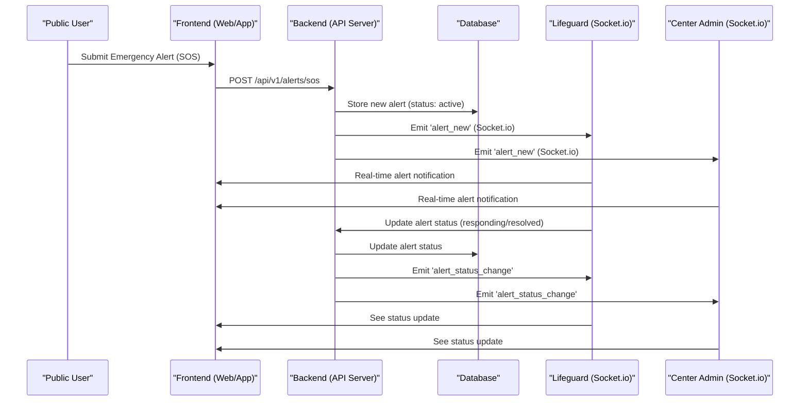
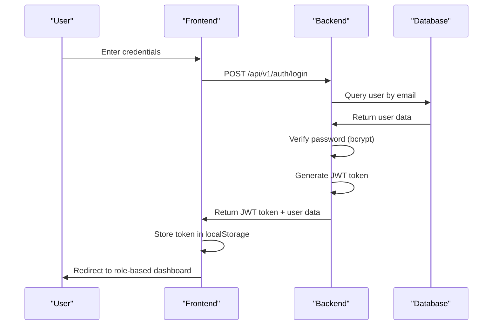
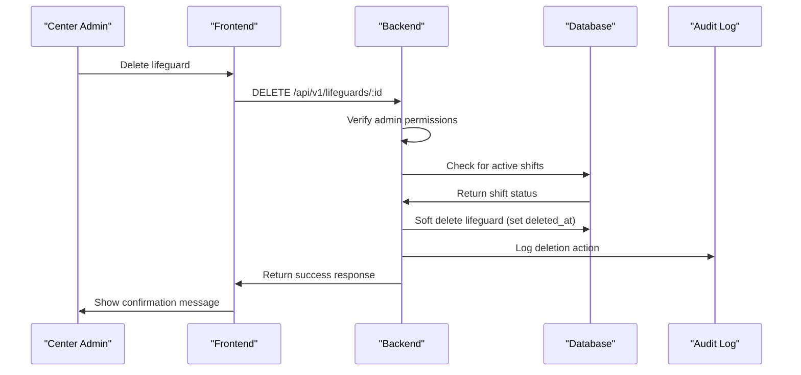

# Beach Safety Management System - Technical Documentation

## Table of Contents
1. [User Stories](#user-stories)
2. [System Architecture](#system-architecture)
3. [Components, Classes, and Database Design](#components-classes-and-database-design)
4. [Sequence Diagrams](#sequence-diagrams)
5. [API Specifications](#api-specifications)
6. [SCM and QA Plans](#scm-and-qa-plans)
7. [Technical Justifications](#technical-justifications)

---

## User Stories

### Must Have (MVP Core Features)

**M1: Emergency Alert System**
- As a **public user**, I want to **submit an emergency alert (SOS)**, so that **lifeguards are immediately notified of the emergency situation**.
- As a **lifeguard**, I want to **receive real-time emergency alerts**, so that **I can respond quickly to emergencies**.
- As a **center admin**, I want to **view and manage emergency alerts**, so that **I can coordinate responses and track incident resolution**.

**M2: User Authentication & Role Management**
- As a **user**, I want to **log in with my credentials**, so that **I can access the system based on my role**.
- As a **system admin**, I want to **manage user accounts and roles**, so that **I can control access and permissions across the system**.

**M3: Lifeguard Management**
- As a **center admin**, I want to **create and manage lifeguard accounts**, so that **I can maintain an up-to-date staff roster**.
- As a **lifeguard**, I want to **view my assigned shifts**, so that **I know when I need to be on duty**.

**M4: Real-time Communication**
- As a **lifeguard**, I want to **receive real-time updates about weather conditions**, so that **I can make informed safety decisions**.
- As a **center admin**, I want to **set safety flags**, so that **I can communicate current beach conditions to the public**.

### Should Have (Important Features)

**S1: Shift Management**
- As a **center admin**, I want to **schedule lifeguard shifts**, so that **I can ensure adequate coverage**.
- As a **lifeguard**, I want to **check in and out of shifts**, so that **my attendance is tracked**.

**S2: Incident Reporting**
- As a **lifeguard**, I want to **file incident reports**, so that **safety incidents are documented for analysis**.

**S3: Weather Integration**
- As a **center admin**, I want to **view real-time weather data**, so that **I can make informed decisions about beach safety**.

### Could Have (Nice to Have)

**C1: Interactive Mapping**
- As a **user**, I want to **view an interactive map of the beach**, so that **I can see safety zones and lifeguard locations**.

**C2: Advanced Analytics**
- As a **system admin**, I want to **view system-wide analytics**, so that **I can assess performance and identify trends**.

### Won't Have (Future Releases)

**W1: Mobile App**
- Mobile application development
- Push notifications
- GPS tracking integration

**W2: Multi-tenant Support**
- Multiple organization support
- Advanced billing features

---

## System Architecture



**Data Flow:**
1. **User Interaction**: Users interact with the React frontend
2. **API Requests**: Frontend makes REST API calls to the Node.js backend
3. **Authentication**: JWT tokens validate user identity and permissions
4. **Rate Limiting**: Express-rate-limit prevents API abuse
5. **Database Operations**: PostgreSQL with PostGIS handles data persistence and spatial queries
6. **External APIs**: Weather data is fetched from external services
7. **Real-time Updates**: Socket.io broadcasts live updates to connected clients

---

## Components, Classes, and Database Design

### Backend Components

#### Controllers
- **AuthController**: Handles user authentication, registration, and profile management
- **CenterController**: Manages beach center operations and settings
- **LifeguardController**: Handles lifeguard CRUD operations and assignments
- **AlertController**: Manages emergency alerts and responses
- **WeatherController**: Integrates with external weather APIs
- **ShiftController**: Manages lifeguard scheduling and attendance
- **ReportController**: Handles incident reporting and documentation

#### Services
- **SocketService**: Manages real-time WebSocket connections and events
- **WeatherService**: Fetches and processes weather data from external APIs
- **LoggerService**: Centralized logging with Winston

#### Middleware
- **AuthMiddleware**: JWT token validation and role-based access control
- **ErrorHandler**: Centralized error handling and response formatting
- **RateLimiter**: API rate limiting for security

### Frontend Components

#### Authentication
- **LoginPage**: User authentication interface
- **RegisterPage**: User registration form
- **AuthContext**: Global authentication state management

#### Role-based Dashboards
- **LifeguardDashboard**: Lifeguard-specific interface
- **CenterDashboard**: Center admin management interface
- **SystemDashboard**: System-wide administration

#### Core Features
- **EmergencyAlerts**: Real-time alert management
- **ShiftManagement**: Shift scheduling and tracking
- **WeatherWidget**: Real-time weather display
- **BeachMap**: Interactive mapping with Leaflet.js

### Database Schema (ER Diagram)



---

## Sequence Diagrams

### 1. Emergency Alert Lifecycle (Public User Initiated)



### 2. User Authentication Flow



### 3. Lifeguard Deletion by Center Admin



---

## API Specifications

### External APIs

#### OpenWeatherMap API
- **Purpose**: Fetch current weather conditions and forecasts
- **Base URL**: `https://api.openweathermap.org/data/2.5/`
- **Authentication**: API key in query parameters
- **Rate Limit**: 1000 calls/day (free tier)
- **Key Endpoints**:
  - `GET /weather` - Current weather data
  - `GET /forecast` - 5-day weather forecast

#### Marine Weather API (Simulated)
- **Purpose**: Ocean conditions and marine safety data
- **Base URL**: Custom implementation
- **Data**: Wave height, water temperature, rip current warnings

### Internal API Endpoints

#### Authentication
| Method | Endpoint | Description | Input | Output |
|--------|----------|-------------|-------|--------|
| POST | `/api/v1/auth/login` | User login | `{email, password}` | `{token, user}` |
| POST | `/api/v1/auth/register` | User registration | `{email, password, role, ...}` | `{token, user}` |
| GET | `/api/v1/auth/me` | Get current user | Headers: `Authorization` | `{user}` |
| PUT | `/api/v1/auth/profile` | Update profile | `{first_name, last_name, phone}` | `{user}` |

#### Centers
| Method | Endpoint | Description | Input | Output |
|--------|----------|-------------|-------|--------|
| GET | `/api/v1/centers` | List centers | Query params | `{centers[]}` |
| GET | `/api/v1/centers/:id` | Get center details | Path param | `{center}` |
| PUT | `/api/v1/centers/:id` | Update center | `{name, description, ...}` | `{center}` |
| PATCH | `/api/v1/centers/:id/rate-limit` | Toggle rate limiting | `{enabled}` | `{center}` |

#### Emergency Alerts
| Method | Endpoint | Description | Input | Output |
|--------|----------|-------------|-------|--------|
| POST | `/api/v1/alerts/sos` | Create SOS alert | `{center_id, location, description}` | `{alert}` |
| GET | `/api/v1/alerts` | List alerts | Query params | `{alerts[]}` |
| PUT | `/api/v1/alerts/:id/status` | Update alert status | `{status}` | `{alert}` |
| POST | `/api/v1/alerts/:id/assign` | Assign to lifeguard | `{lifeguard_id}` | `{alert}` |

#### Lifeguards
| Method | Endpoint | Description | Input | Output |
|--------|----------|-------------|-------|--------|
| GET | `/api/v1/lifeguards` | List lifeguards | Query params | `{lifeguards[]}` |
| POST | `/api/v1/lifeguards` | Create lifeguard | `{user_data, lifeguard_data}` | `{lifeguard}` |
| PUT | `/api/v1/lifeguards/:id` | Update lifeguard | `{certification_level, ...}` | `{lifeguard}` |
| DELETE | `/api/v1/lifeguards/:id` | Delete lifeguard | Path param | `{success}` |

#### Shifts
| Method | Endpoint | Description | Input | Output |
|--------|----------|-------------|-------|--------|
| GET | `/api/v1/shifts` | List shifts | Query params | `{shifts[]}` |
| POST | `/api/v1/shifts` | Create shift | `{lifeguard_id, start_time, end_time}` | `{shift}` |
| POST | `/api/v1/shifts/:id/check-in` | Check in to shift | `{location}` | `{shift}` |
| POST | `/api/v1/shifts/:id/check-out` | Check out of shift | - | `{shift}` |

#### Weather
| Method | Endpoint | Description | Input | Output |
|--------|----------|-------------|-------|--------|
| GET | `/api/v1/weather/centers/:id/current` | Current weather | Path param | `{weather}` |
| GET | `/api/v1/weather/centers/:id/forecast` | Weather forecast | Path param | `{forecast[]}` |

#### Safety
| Method | Endpoint | Description | Input | Output |
|--------|----------|-------------|-------|--------|
| GET | `/api/v1/safety/centers/:id/current` | Current safety flag | Path param | `{flag}` |
| POST | `/api/v1/safety/centers/:id/flags` | Set safety flag | `{flag_status, reason}` | `{flag}` |

### Response Format
All API responses follow this structure:
```json
{
  "success": true,
  "data": {...},
  "message": "Operation successful"
}
```

Error responses:
```json
{
  "success": false,
  "error": "Error message",
  "code": "ERROR_CODE"
}
```

---

## SCM and QA Plans

### Source Control Management (SCM)

#### Git Workflow
- **Repository**: Git-based version control
- **Branching Strategy**: 
  - `main`: Production-ready code
  - `develop`: Integration branch
  - `feature/*`: Feature development branches
  - `hotfix/*`: Emergency fixes

#### Development Process
1. **Feature Development**:
   - Create feature branch from `develop`
   - Implement feature with regular commits
   - Write tests for new functionality
   - Submit pull request to `develop`

2. **Code Review**:
   - All changes require pull request review
   - Automated testing on pull request
   - Manual code review for security and best practices

3. **Integration**:
   - Merge approved features to `develop`
   - Regular integration testing
   - Deploy to staging environment

4. **Release**:
   - Merge `develop` to `main` for releases
   - Tag releases with semantic versioning
   - Deploy to production environment

#### Commit Standards
- **Format**: `type(scope): description`
- **Types**: feat, fix, docs, style, refactor, test, chore
- **Example**: `feat(alerts): add emergency alert rate limiting`

### Quality Assurance (QA)

#### Testing Strategy

**Unit Testing**:
- **Framework**: Jest
- **Coverage**: Backend controllers, services, utilities
- **Frontend**: React component testing with React Testing Library
- **Target**: 80% code coverage minimum

**Integration Testing**:
- **API Testing**: Postman collections for all endpoints
- **Database Testing**: Integration tests for database operations
- **Authentication Testing**: JWT token validation and role-based access

**End-to-End Testing**:
- **Framework**: Cypress
- **Scenarios**: User authentication, emergency alert flow, lifeguard management
- **Coverage**: Critical user journeys

#### Testing Tools
- **Backend**: Jest, Supertest
- **Frontend**: React Testing Library, Jest
- **API**: Postman, Newman (CLI)
- **E2E**: Cypress
- **Coverage**: Istanbul/nyc

#### Test Environment
- **Development**: Local testing with mock data
- **Staging**: Production-like environment for integration testing
- **Production**: Smoke tests after deployment

#### Deployment Pipeline

**Staging Deployment**:
1. Code merged to `develop`
2. Automated tests run
3. Build and deploy to staging
4. Integration tests run
5. Manual testing by QA team

**Production Deployment**:
1. Code merged to `main`
2. Automated tests run
3. Build production assets
4. Deploy to production
5. Smoke tests run
6. Monitor application health

#### Quality Gates
- All tests must pass
- Code coverage requirements met
- Security scan passed
- Performance benchmarks met
- Documentation updated

---

## Technical Justifications

### Technology Stack Rationale

#### Frontend: React + TypeScript
- **React**: Component-based architecture, large ecosystem, excellent developer experience
- **TypeScript**: Type safety reduces bugs, better IDE support, improved maintainability
- **Material-UI**: Consistent design system, accessibility features, rapid development
- **Socket.io Client**: Real-time communication with backend

#### Backend: Node.js + Express
- **Node.js**: JavaScript runtime, excellent for I/O-intensive applications, large ecosystem
- **Express**: Minimal, flexible framework, extensive middleware ecosystem
- **JWT**: Stateless authentication, scalable, industry standard
- **bcrypt**: Secure password hashing, industry best practice

#### Database: PostgreSQL + PostGIS
- **PostgreSQL**: ACID compliance, advanced features, excellent performance
- **PostGIS**: Spatial data support, geographic queries, industry standard for GIS
- **UUIDs**: Distributed ID generation, no sequential dependencies
- **JSONB**: Flexible data storage for complex objects

#### Real-time: Socket.io
- **Socket.io**: Bidirectional communication, automatic reconnection, room management
- **WebSocket**: Low latency, efficient for real-time updates
- **Fallback**: Automatic fallback to HTTP long polling

### Architecture Decisions

#### Microservices vs Monolithic
- **Choice**: Monolithic architecture
- **Rationale**: Team size (individual), simplicity, easier deployment and testing
- **Future**: Can be refactored to microservices as the application grows

#### REST vs GraphQL
- **Choice**: REST API
- **Rationale**: Simpler to implement, better caching, easier to understand
- **Future**: GraphQL could be added for complex data fetching

#### Authentication Strategy
- **Choice**: JWT tokens
- **Rationale**: Stateless, scalable, works well with mobile apps
- **Security**: Short expiration times, refresh token rotation

#### Database Design
- **Choice**: Relational database with spatial extensions
- **Rationale**: ACID compliance, complex relationships, spatial queries
- **Performance**: Proper indexing, query optimization

### Security Considerations

#### Authentication & Authorization
- **JWT**: Secure token-based authentication
- **bcrypt**: Industry-standard password hashing
- **RBAC**: Role-based access control at API level
- **Rate Limiting**: Prevent abuse and DoS attacks

#### Data Protection
- **Input Validation**: Comprehensive validation on all inputs
- **SQL Injection Prevention**: Parameterized queries
- **XSS Protection**: Input sanitization, CSP headers
- **CORS**: Proper cross-origin resource sharing configuration

#### Audit & Compliance
- **Audit Logging**: All critical actions logged
- **Soft Delete**: Data recoverability
- **Audit Trail**: Complete history of changes

### Performance Optimizations

#### Database
- **Indexing**: Strategic indexes on frequently queried columns
- **Query Optimization**: Efficient SQL queries
- **Connection Pooling**: Reuse database connections

#### API
- **Caching**: Response caching for static data
- **Pagination**: Large dataset handling
- **Rate Limiting**: Prevent abuse

#### Frontend
- **Code Splitting**: Lazy loading of components
- **Bundle Optimization**: Minimized JavaScript bundles
- **CDN**: Static asset delivery

### Scalability Considerations

#### Horizontal Scaling
- **Stateless Backend**: Easy to scale horizontally
- **Database**: Read replicas for read-heavy workloads
- **Caching**: Redis for session storage and caching

#### Vertical Scaling
- **Resource Monitoring**: CPU, memory, disk usage
- **Performance Profiling**: Identify bottlenecks
- **Database Optimization**: Query optimization, indexing

### Monitoring & Observability

#### Logging
- **Winston**: Structured logging
- **Log Levels**: Error, warn, info, debug
- **Log Aggregation**: Centralized log collection

#### Metrics
- **Response Times**: API endpoint performance
- **Error Rates**: Application error monitoring
- **Resource Usage**: Server resource monitoring

#### Health Checks
- **Application Health**: `/health` endpoint
- **Database Connectivity**: Connection pool status
- **External Services**: Weather API availability

This technical documentation provides a comprehensive overview of the Beach Safety Management System's architecture, implementation details, and development processes. It serves as a reference for developers, stakeholders, and future maintenance teams. 