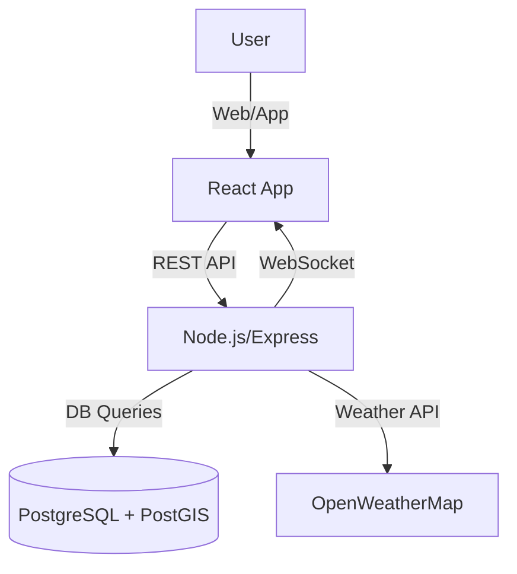
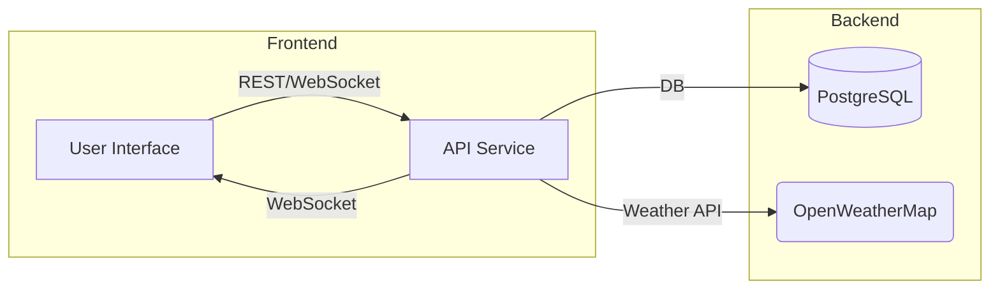

# Beach Safety App: Comprehensive Overview

---

## Introduction

The **Beach Safety App** is a full-stack web application designed to enhance safety and operational efficiency at beach centers. It provides real-time monitoring, alerting, and management tools for lifeguards, center admins, and system administrators, integrating weather data, incident reporting, and shift management.

---

## System Architecture

- **Backend:** Node.js, Express, PostgreSQL (with PostGIS for geospatial queries)
- **Frontend:** React, TypeScript, Material-UI
- **Real-Time:** WebSockets for live alerts and updates
- **External Integrations:** OpenWeatherMap API for real weather data; simulated marine data

---

## Key Features

### For Lifeguards
- **Dashboard:** View real-time emergency alerts, weather, and safety flags
- **My Shifts:** Calendar and list view of assigned shifts; check-in/check-out with location validation
- **Incident Reporting:** Submit and review incident reports
- **Emergency Alerts:** Receive and acknowledge alerts with map-based geolocation

### For Center Admins
- **Center Dashboard:** Monitor center status, lifeguard activity, and safety flags
- **Shift Scheduling:** Assign, edit, and view lifeguard shifts (calendar & list views)
- **Lifeguard Management:** Add, remove, and manage lifeguard accounts
- **Safety Flag Management:** View flag history, trigger auto-updates, set manual overrides, and configure location-based check-in
- **Incident & Escalation Management:** Review and escalate incidents

### For System Admins
- **System Dashboard:** Overview of all centers, global safety status
- **User Management:** Manage all users and roles
- **Flag Analytics:** View and audit safety flag status across all centers
- **Force Updates:** Trigger system-wide flag or weather updates

---

## User Roles & Permissions

- **Lifeguard:**
  - View own shifts, check in/out, receive alerts, submit reports
- **Center Admin:**
  - Manage lifeguards, shifts, safety flags, and incidents for their center
- **System Admin:**
  - Full access to all centers, users, and system settings

---

## Backend Workflows

### 1. Weather & Safety Flag Automation
- Fetches real weather data every 15 minutes for each center
- Simulates marine data (wave height, currents)
- Determines safety flag (green/yellow/red/black) based on configurable thresholds
- Sets automatic flag with 14-minute expiration; respects manual overrides (2-hour expiration)
- Triggers WebSocket updates to frontend clients

### 2. Shift & Check-In Logic
- Shifts assigned to lifeguards by center admin
- Lifeguards can check in only for today’s shifts, and only within 2 hours of start time
- Optional: Check-in restricted to within 10km of center (configurable)

### 3. Emergency Alerts
- Alerts created by admins or triggered by incidents
- Alerts broadcast in real-time to relevant lifeguards and admins
- Alerts include geolocation and severity

### 4. Incident & Escalation Management
- Lifeguards submit incident reports
- Admins review, escalate, and resolve incidents

---

## Frontend Workflows

### 1. Real-Time Dashboards
- Lifeguard and admin dashboards auto-update via WebSocket for alerts, flags, and weather

### 2. Calendar & List Views
- Shifts and schedules shown in both calendar and list formats
- Drag-and-drop and quick edit features for admins

### 3. Map Integration
- Emergency alerts and safety zones visualized on interactive maps
- Weather overlays and flag status shown on map

### 4. User Feedback & Validation
- Clear error messages and status indicators for check-in, flag status, and alerts

---

## Real-Time & Scheduled Features

- **WebSocket:**
  - Emergency alerts, flag changes, and weather updates pushed instantly to clients
- **Schedulers:**
  - Weather and safety flag updates every 15 minutes
  - Expired manual flags revert to automatic mode

---

## Extensibility & Customization

- **Configurable Safety Flag Conditions:** (future)
  - Thresholds for flag status can be made center-specific
- **Modular API:**
  - RESTful endpoints for all major resources (users, shifts, flags, alerts, reports)
- **Role-Based Access Control:**
  - Easily extendable for new roles or permissions

---

## Example User Flows

### Lifeguard Check-In
1. Lifeguard logs in and views today’s shifts
2. Checks in (location-validated if enabled)
3. Receives real-time alerts and weather updates

### Center Admin Sets Manual Flag
1. Admin reviews weather and flag status
2. Sets manual flag (expires in 2 hours)
3. System respects manual override until expiration

### Automatic Flag Update
1. Scheduler fetches weather every 15 minutes
2. System determines new flag and sets automatic flag (expires in 14 minutes)
3. If manual flag is active and not expired, system does not override

---

## Diagrams

### System Overview

---

## Conclusion

The Beach Safety App provides a robust, real-time platform for managing beach safety operations, integrating weather intelligence, incident management, and shift scheduling. Its modular, extensible design supports future enhancements and scaling to additional centers or regions. 