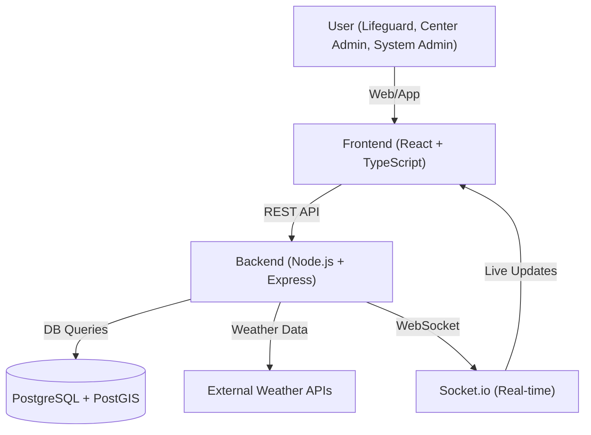
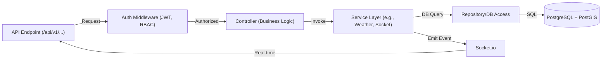
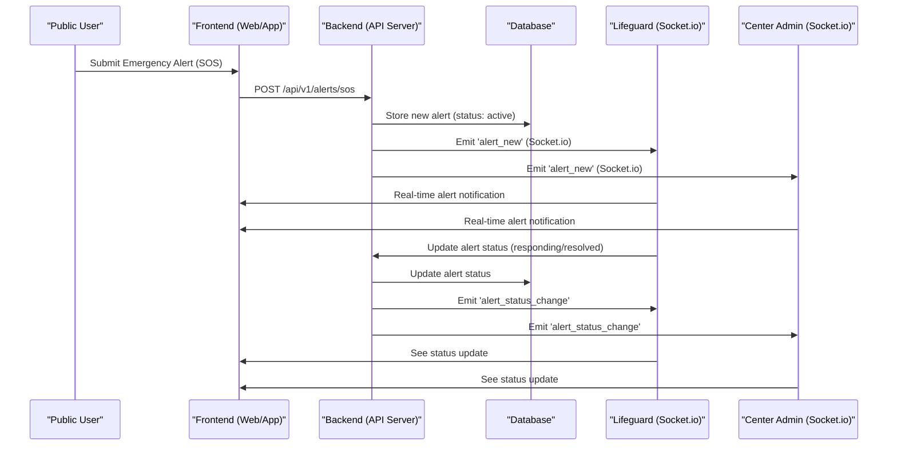

# Slide 1: Beach Safety Management System

**Slide Text:**
- Beach Safety Management System
- Individual Project Showcase

**Speaker Notes:**
Welcome to my presentation on the Beach Safety Management System. This is a comprehensive, real-time web application designed and implemented as a solo project. Today, I'll walk you through the journey, technical highlights, and the MVP in action.

---

# Slide 2: Project Introduction & Goals

**Slide Text:**
- Purpose: Enhance beach safety operations
- Real-time monitoring, emergency response, and compliance
- Individual project (not a team effort)

**Speaker Notes:**
The main goal was to create a robust platform for managing beach safety, with features like real-time lifeguard tracking, emergency alerting, and strong compliance/audit capabilities. This project was completed individually, allowing for deep, end-to-end ownership of every aspect.

---

# Slide 3: Process Summary

**Slide Text:**
- Project Lifecycle Stages:
  - Requirements & Research
  - Architecture & Planning
  - Implementation (Backend & Frontend)
  - Testing & Debugging
  - Deployment & Documentation
- Major Decisions:
  - Real-time features (Socket.io)
  - Spatial data (PostGIS)
  - Role-based access (RBAC)
- Key Challenges:
  - Integrating real-time and spatial data
  - Ensuring security and compliance

**Speaker Notes:**
The process began with requirements gathering and research, followed by careful architectural planning. Implementation was split between backend and frontend, with a strong focus on real-time and spatial features. Testing and debugging were iterative, and deployment included comprehensive documentation. Key decisions included using Socket.io for real-time updates, PostGIS for spatial data, and strict RBAC for security. Integrating these technologies and ensuring compliance were the main challenges.

---

# Slide 4: Technical Architecture

**Slide Text:**
- Full-stack: React (TypeScript) + Node.js (Express)
- PostgreSQL + PostGIS for spatial data
- Real-time: Socket.io
- Secure: JWT, bcrypt, audit logging
- Modular, service-oriented design
- [System Architecture Diagram]



**Speaker Notes:**
The application is built with a modern full-stack architecture. The frontend uses React and TypeScript for a robust, type-safe UI. The backend is Node.js with Express, connected to a PostgreSQL database enhanced with PostGIS for spatial queries. Real-time features are powered by Socket.io, and security is enforced with JWT, bcrypt, and comprehensive audit logging. The architecture is modular and service-oriented for maintainability and scalability.

---

# Slide 5: Code Implementation Highlights

**Slide Text:**
- WebSocket Real-time Communication
- Weather Data Integration
- [Code Snippets Below]

**WebSocket Implementation:**
```javascript
// Emergency Alert Flow: Public User → Server → Lifeguards & Admins

// 1. Public user creates emergency alert (REST API)
const createSOSAlert = async (req, res) => {
  const { location, description, center_id } = req.body;
  
  // Find nearest center if not specified
  const nearestCenter = await findNearestCenter(location.lat, location.lng);
  const targetCenterId = center_id || nearestCenter.id;
  
  // Store alert in database
  const result = await query(`
    INSERT INTO emergency_alerts (center_id, alert_type, severity, location, description, status)
    VALUES ($1, 'sos', 'critical', ST_SetSRID(ST_MakePoint($2, $3), 4326), $4, 'active')
    RETURNING *
  `, [targetCenterId, location.lng, location.lat, description]);
  
  const alert = result.rows[0];
  
  // 2. Broadcast real-time alert to center
  emitEmergencyAlert(alert);
  
  res.status(201).json({ success: true, data: alert });
};

// 3. Socket.io broadcasting function
const emitEmergencyAlert = (alertData) => {
  if (io) {
    // Broadcast to specific center room
    io.to(`center_${alertData.center_id}`).emit('emergency_alert', {
      id: alertData.id,
      alert_type: alertData.alert_type,
      severity: alertData.severity,
      location: alertData.location,
      description: alertData.description,
      status: alertData.status,
      timestamp: new Date().toISOString()
    });
    
    // Also notify system admin room
    io.to('system_admin').emit('emergency_alert', {
      ...alertData,
      timestamp: new Date().toISOString()
    });
  }
};

// 4. Socket.io connection handling
const initializeSocket = (socketIo) => {
  io = socketIo;
  
  io.on('connection', (socket) => {
    // Lifeguards and admins join their center room
    socket.on('join_center', (centerId) => {
      socket.join(`center_${centerId}`);
      logger.info('Client joined center room', { socketId: socket.id, centerId });
    });
    
    // System admins join system-wide room
    socket.on('join_system', () => {
      socket.join('system_admin');
      logger.info('Client joined system admin room', { socketId: socket.id });
    });
    
    // 5. Lifeguard acknowledges the alert
    socket.on('acknowledge_alert', async (data) => {
      const { alertId, lifeguardId } = data;
      
      // Update alert status in database
      await query(
        'UPDATE emergency_alerts SET status = $1, assigned_lifeguard_id = $2 WHERE id = $3',
        ['responding', lifeguardId, alertId]
      );
      
      // 6. Broadcast acknowledgment to center
      io.to(`center_${alert.center_id}`).emit('alert_acknowledged', {
        alertId, lifeguardId, status: 'responding'
      });
    });
  });
};
```

**Weather Data Integration:**
```javascript
// Weather Service - API Integration & Data Processing
class WeatherService {
  async getCurrentWeather(centerId) {
    // Get center coordinates from database
    const centerResult = await query(
      'SELECT ST_X(location) as lng, ST_Y(location) as lat FROM centers WHERE id = $1',
      [centerId]
    );
    
    const { lng, lat } = centerResult.rows[0];
    
    // Fetch from OpenWeatherMap API
    const response = await axios.get(`${this.baseUrl}/weather`, {
      params: { lat, lon: lng, appid: this.apiKey, units: 'metric' }
    });
    
    // Transform and store in database
    const transformedData = {
      center_id: centerId,
      temperature: response.data.main.temp,
      wind_speed: response.data.wind.speed,
      weather_condition: response.data.weather[0].main,
      visibility: response.data.visibility / 1000, // Convert to km
      recorded_at: new Date()
    };
    
    return await this.storeWeatherData(transformedData);
  }
}
```

**Speaker Notes:**
Here are two key implementation highlights. First, the WebSocket communication shows the complete emergency alert flow: a public user creates an SOS alert via REST API, the server stores it in the database, then immediately broadcasts the alert to all connected lifeguards and center admins in that specific center using Socket.io rooms. When a lifeguard acknowledges the alert, the status update is broadcasted back to everyone in real-time. Second, the weather integration fetches real-time data from OpenWeatherMap API, transforms it into our standardized format, and stores it in the database with spatial coordinates. Both systems are designed for reliability and real-time responsiveness.

---

# Slide 6: Key Internal Mechanisms

**Slide Text:**
- RESTful API with versioning
- Middleware for authentication and RBAC
- Service layer for business logic
- Real-time event handling
- [Backend Flow Diagram]



**Emergency Alert Lifecycle (Public User Initiated):**



**Speaker Notes:**
Internally, the backend follows a layered approach. API endpoints are protected by authentication and role-based access middleware. Controllers handle business logic, delegating to services for complex operations like weather integration or real-time events. The repository layer abstracts database access, and Socket.io is used for emitting real-time updates to clients. This structure ensures clear separation of concerns and maintainability.

The sequence diagram below illustrates the full lifecycle of an emergency alert initiated by a public user. It shows how the alert is submitted, stored, and broadcast in real time to lifeguards and center admins, and how status updates propagate through the system.

---

# Slide 7: Technology Choices & Rationale

**Slide Text:**
- React + TypeScript: Modern, type-safe UI
- Node.js + Express: Fast, scalable backend
- PostgreSQL + PostGIS: Relational + spatial data
- Socket.io: Real-time communication
- JWT & bcrypt: Security best practices
- Modular, testable codebase

**Speaker Notes:**
Each technology was chosen for its strengths: React and TypeScript for a modern, maintainable frontend; Node.js and Express for a performant backend; PostgreSQL with PostGIS for advanced spatial data support; and Socket.io for real-time features. Security is a priority, with JWT for authentication and bcrypt for password hashing. The codebase is modular and testable, supporting future growth.

---

# Slide 8: Noteworthy Implementation Details

**Slide Text:**
- Role-based access control (RBAC) at every layer
- Soft/hard delete with audit logging
- Real-time weather and alert updates
- Interactive mapping (Leaflet.js)
- Automated database migrations
- Comprehensive test coverage

**Speaker Notes:**
Some highlights include strict RBAC enforcement, soft and hard delete mechanisms with full audit trails, and real-time updates for weather and emergency alerts. The frontend features interactive mapping with Leaflet.js, and the backend supports automated migrations. Comprehensive testing ensures reliability.

---

# Slide 9: MVP Demo

**Slide Text:**
- Live demo: Core features in action
  - User login & role-based dashboard
  - Real-time emergency alerts
  - Lifeguard shift management
  - Incident reporting
  - Interactive map & weather widget
- [Screenshots or live preview]

**Speaker Notes:**
In the demo, I'll showcase the MVP's core features: logging in as different roles, receiving and responding to real-time emergency alerts, managing lifeguard shifts, filing incident reports, and using the interactive map and weather widget. Screenshots or a live preview will illustrate these workflows.

---

# Slide 10: Results & Reflection

**Slide Text:**
- Outcomes:
  - Fully functional MVP
  - Real-time, spatial, and secure
- Performance:
  - Fast response times
  - Scalable architecture
- Lessons Learned:
  - Integrating real-time and spatial data
  - Importance of modular design
  - Value of comprehensive testing

**Speaker Notes:**
The project resulted in a fully functional MVP with real-time, spatial, and secure features. Performance is strong, with fast response times and a scalable architecture. Key lessons include the complexity of integrating real-time and spatial data, the benefits of modular design, and the necessity of thorough testing.

---

# Slide 11: Conclusion & Next Steps

**Slide Text:**
- Future Development:
  - Advanced analytics & reporting
  - Mobile app version
  - Push notifications
  - Multi-tenant support
- Thank you!

**Speaker Notes:**
Looking ahead, future development could include advanced analytics, a mobile app, push notifications, and multi-tenant support. Thank you for your attention—I'm happy to answer any questions or discuss the project further. 