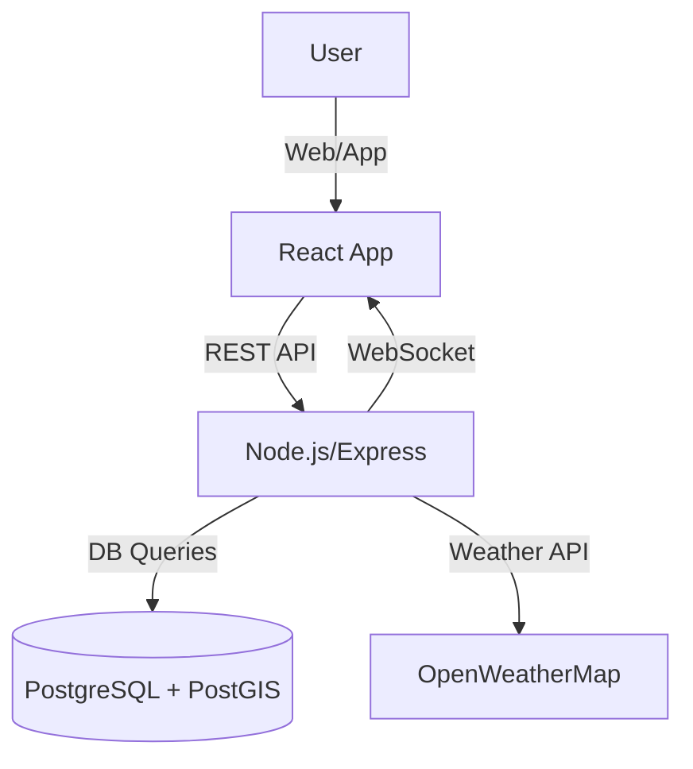

# Beach Safety App: Technical Documentation

---

## 1. Overview

The Beach Safety App is a full-stack web application for real-time beach safety management. It integrates weather data, incident reporting, shift scheduling, and emergency alerting for lifeguards, center admins, and system administrators. The system is designed for extensibility, security, and real-time responsiveness.

---

## 2. System Architecture

- **Backend:** Node.js (Express), PostgreSQL (with PostGIS)
- **Frontend:** React (TypeScript), Material-UI
- **Real-Time:** WebSockets (Socket.IO)
- **External APIs:** OpenWeatherMap, simulated marine data

### High-Level Diagram


---

## 3. Backend

### 3.1 API Structure
- **RESTful endpoints** under `/api/v1/`
- **Resource-based routing:**
  - `/auth` (login, register, token validation)
  - `/centers` (center info, settings)
  - `/lifeguards` (CRUD, assignments)
  - `/shifts` (CRUD, check-in/out)
  - `/alerts` (emergency alerts)
  - `/reports` (incident reports)
  - `/safety` (safety flags, history, auto/manual update)
  - `/weather` (current, forecast)
  - `/escalations`, `/interCenterSupport`, etc.

#### Example Route Definition
```js
// backend/src/routes/safety.js
router.get('/centers/:centerId/current', verifyToken, requireRole(['center_admin', 'system_admin']), getCurrentSafetyFlag);
router.post('/centers/:centerId/auto-update', verifyToken, requireRole(['center_admin', 'system_admin']), triggerAutomaticFlagUpdate);
```

### 3.2 Database Schema
- **PostgreSQL** with **PostGIS** for geospatial queries
- **Key Tables:**
  - `users` (id, name, email, role, password_hash, ...)
  - `centers` (id, name, location, require_location_check_in, ...)
  - `shifts` (id, center_id, lifeguard_id, start_time, end_time, ...)
  - `safety_flags` (id, center_id, flag_status, reason, set_by, set_at, expires_at, ...)
  - `emergency_alerts` (id, center_id, location, severity, ...)
  - `incident_reports`, `weather_data`, etc.

#### Example Table: safety_flags
| Column      | Type      | Description                       |
|------------|-----------|-----------------------------------|
| id         | UUID      | Primary key                       |
| center_id  | UUID      | Foreign key to centers            |
| flag_status| TEXT      | green/yellow/red/black            |
| reason     | TEXT      | Reason for flag                   |
| set_by     | UUID      | User who set the flag             |
| set_at     | TIMESTAMP | When flag was set                 |
| expires_at | TIMESTAMP | When flag expires                 |

### 3.3 Models & Services
- **Models:** Plain SQL queries (no ORM), organized by resource
- **Services:**
  - `weatherService.js`: Fetches weather, simulates marine data, determines safety flags, manages schedulers
  - `socketService.js`: Manages WebSocket connections and events
  - `logger.js`: Centralized logging

#### Example: Weather Service (core logic)
```js
// backend/src/services/weatherService.js
async updateSafetyFlagAutomatically(centerId) {
  // Fetch weather, determine flag, set automatic flag with 14-min expiration
}
```

### 3.4 Middleware
- **Authentication:** JWT-based (`auth.js`)
- **Role-based access:** `requireRole(['center_admin', ...])`
- **Ownership checks:** For resource modification
- **Error handling:** Centralized error handler

### 3.5 Schedulers & Automation
- **Weather update:** Every 15 minutes for all centers
- **Safety flag auto-update:** Every 15 minutes (automatic flags expire in 14 minutes)
- **Manual flag expiration:** 2 hours (manual override respected until expiration)
- **Expired manual flags:** Revert to automatic mode

### 3.6 Error Handling & Logging
- **Centralized logger** (`utils/logger.js`)
- **Structured logs** with context (service, user, error stack)
- **API error responses:** Consistent JSON format

---

## 4. Frontend

### 4.1 Component Structure
- **Pages:**
  - `LifeguardDashboard`, `CenterDashboard`, `SystemDashboard`
  - `ShiftManagement`, `SafetyManagement`, `IncidentReports`, etc.
- **Common Components:**
  - `Layout`, `NotificationSystem`, `LoadingScreen`, `BeachMap`, etc.
- **Role-based routing** and context

### 4.2 State Management
- **React Context:** Auth state (`AuthContext.tsx`)
- **Component state:** Local for forms, dialogs, etc.
- **API Service:** Centralized (`services/api.ts`)

### 4.3 API Integration
- **REST API:** All backend endpoints consumed via `apiService`
- **Error handling:** User feedback via snackbars, alerts
- **Token management:** JWT in localStorage, auto-logout on 401

### 4.4 Real-Time Features
- **WebSocket (Socket.IO):**
  - Real-time emergency alerts, flag changes, weather updates
  - Subscribes to center-specific rooms
  - Updates UI instantly on relevant events

#### Example: useSocket Hook
```ts
// frontend/src/hooks/useSocket.ts
const socket = useSocket(centerId);
socket.on('emergency_alert', (alert) => { ... });
```

### 4.5 UI/UX
- **Material-UI:** Consistent, responsive design
- **Map integration:** Leaflet-based `BeachMap` for geospatial data
- **Calendar views:** For shifts and schedules
- **Accessibility:** Keyboard navigation, ARIA labels

---

## 5. Real-Time & Scheduled Operations

- **WebSocket Events:**
  - `emergency_alert`, `flag_update`, `weather_update`, etc.
- **Schedulers:**
  - Weather and flag updates every 15 minutes
  - Expired manual flags checked and reverted
- **Frontend auto-refresh:** On relevant WebSocket events

---

## 6. Security & Authentication

- **JWT Authentication:**
  - Tokens issued on login, required for all protected endpoints
  - Token validation middleware
- **Role-Based Access Control:**
  - `requireRole` middleware for endpoints
- **Password Hashing:**
  - Secure storage (bcrypt or similar)
- **Input Validation:**
  - Backend validation for all user input
- **CORS:**
  - Configured for frontend-backend communication

---

## 7. Deployment & Environment

- **Environment Variables:**
  - API keys, DB credentials, JWT secrets in `.env` (see `env.example`)
- **Logging:**
  - Log files in `backend/logs/`
- **Startup Scripts:**
  - `npm start` for backend and frontend
- **Database Setup:**
  - SQL scripts for schema and seed data
- **Production Considerations:**
  - HTTPS, reverse proxy, scaling WebSocket server

---

## 8. Extensibility & Best Practices

- **Modular codebase:**
  - Separate controllers, services, routes, and models
- **API versioning:**
  - All endpoints under `/api/v1/`
- **Testing:**
  - Unit and integration tests recommended (not included by default)
- **Documentation:**
  - Inline code comments, README, and this technical_doc.md
- **Future Enhancements:**
  - Configurable safety flag thresholds per center
  - Mobile app integration
  - Advanced analytics and reporting

---

## Appendix: Example API Response
```json
{
  "success": true,
  "data": {
    "flag_status": "red",
    "reason": "High waves and strong currents",
    "set_at": "2025-07-13T15:00:00Z",
    "expires_at": "2025-07-13T17:00:00Z"
  }
}
```

---

## Contact & Contribution

For questions, contributions, or bug reports, see the project README or contact the maintainers. 